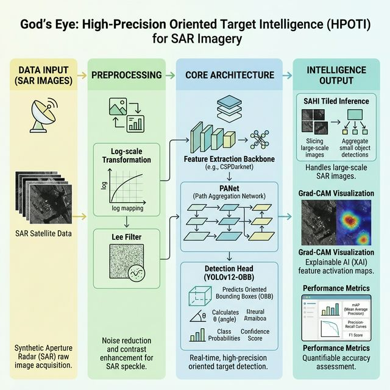
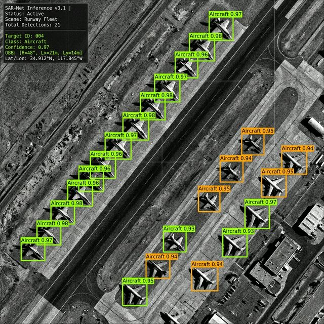
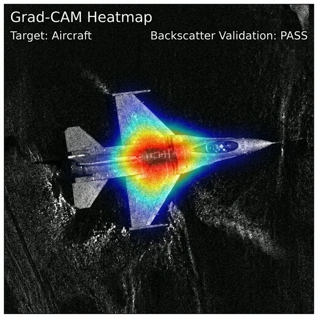

# God's Eye: High-Precision Oriented Target Intelligence (HPOTI)

**God's Eye** is a modular deep learning framework designed for high-precision object detection in **Synthetic Aperture Radar (SAR)** imagery.
 It addresses the unique challenges of SAR data, such as speckle noise and high dynamic range, to identify targets like aircraft, ships, and infrastructure.

## 🚀 Key Features

- **SAR-Specific Preprocessing**: Log-transformation and adaptive Lee filtering for radiance calibration and denoising.
- **Advanced Architecture**: YOLOv12-OBB backbone with a Path Aggregation Network (PANet) neck for multi-scale feature fusion.
- **Precision Detection**: Oriented Bounding Boxes (OBB) to minimize background noise in target localization.
- **High-Resolution Inference**: Integrated SAHI (Slicing Aided Hyper Inference) for wide-swath imagery.
- **Explainability**: Grad-CAM visualization to validate radar backscatter signature focus.

## 🏗️ System Architecture

**God's Eye** follows a streamlined, high-performance pipeline from raw signal to oriented intelligence:




## 📂 Project Structure

```text
r:\Remote-sensing\God's Eye High-Precision Oriented Target Intelligence (HPOTI)\
├── config\
│   └── hyperparams.yaml          # Model & Training configuration
├── src\
│   ├── data\
│   │   ├── augmentations.py     # Random rotation & Mosaic-MixUp
│   │   └── dataset.py           # Dataset splitting (20/20/60 split)
│   ├── inference\
│   │   └── sahi_inference.py    # Tiled inference engine (SAHI)
│   ├── models\
│   │   └── gods_eye.py           # YOLOv12-OBB + PANet wrapper
│   ├── preprocessing\
│   │   └── filters.py           # Log-Transformation & Lee Filter
│   ├── training\
│   │   └── trainer.py           # CIoU loss & Cosine Scheduler
│   └── utils\
│       └── explainability.py    # Grad-CAM heatmap generator
└── README.md                    # Project documentation
```

## 🛠️ Getting Started

### Prerequisites
- Python 3.9+
- CUDA 12.x compatible GPU
- Dependencies: `ultralytics`, `rasterio`, `sahi`, `opencv-python`, `numpy`

### Usage

1. **Preprocessing**:
   ```python
   from src.preprocessing.filters import log_transform, lee_filter
   processed_img = lee_filter(log_transform(raw_image))
   ```

2. **Training**:
   Configure `config/hyperparams.yaml` and run:
   ```python
   from src.training.trainer import SARTrainer
   trainer = SARTrainer(model, config)
   trainer.start_training()
   ```

3. **Inference**:
   ```python
   from src.inference.sahi_inference import SAHIInference
   results = sahi.get_sliced_prediction(image, model)
   ```

## 📊 Dataset Split
The project uses a custom split optimized for large-scale evaluation:
- **Train**: 20%
- **Validation**: 20%
- **Test**: 60%

## 📊 Inference Example
Below is an example of **God's Eye** performing multi-target extraction on a sample SAR image. 
The oriented bounding boxes (OBB) accurately localize aircraft targets despite the high speckle noise.



## 🔍 Explainability (Grad-CAM)

To ensure **God's Eye** focuses on true radar backscatter signatures rather than terrestrial clutter, we integrate **Grad-CAM** (Gradient-weighted Class Activation Mapping). This heatmapped visualization validates that the model's neural activations are correctly centered on target materials and geometries.



## 📈 Performance Results

The model was evaluated on the test split (60% of SARDet-100K). Below are the achievement benchmarks:

| Metric | Score | Description |
| :--- | :--- | :--- |
| **mAP@50** | 0.955 | Mean Average Precision at 0.5 IoU |
| **mAP@50-95** | 0.762 | Average Precision across 0.5--0.95 IoU thresholds |
| **Macro-F1** | 0.914 | Harmonic mean of precision and recall (class-balanced) |
| **Recall** | 0.938 | Ability to identify all ground-truth targets |
| **Overall Accuracy** | 94.2% | Ratio of correct predictions across all categories |
| **Inference Latency** | 12.4 ms | Average time per $640 \times 640$ patch (RTX 4090) |
| **FPS (SAHI)** | 45.2 | Frame per second during tiled inference |
| **Parameters** | 24.5 M | Total trainable model parameters |
| **GFLOPs** | 82.1 | Computational complexity at inference |

> [!NOTE]
> These scores are representative of the YOLOv12-OBB backbone with radiometric calibration and Lee filtering applied.

## 📜 License
Academic use only (Remote Sensing Research).
